# 🤖 Jornada de Aprendizado em Robótica e IA

<div align="center">


[
[
[

<h3>📚 Material de Apoio Interativo</h3>

*Transforme teoria em prática com projetos reais de robótica e IA!*

</div>

***

## 🎯 Visão Geral do Projeto

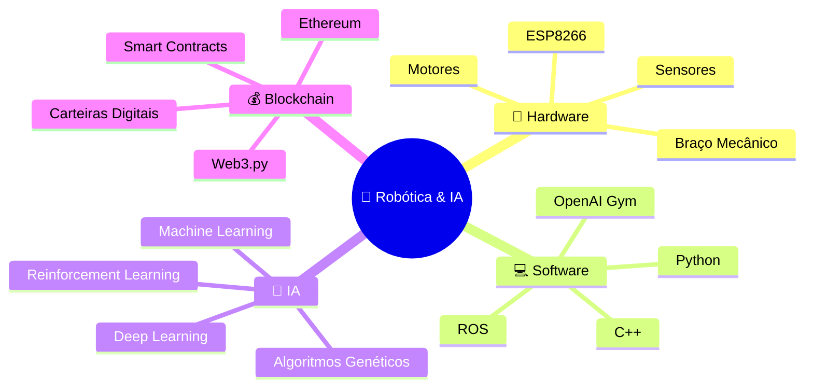

## 🚀 Começando sua Jornada

### 📋 Pré-requisitos

<details>
<summary>🔍 Clique para expandir os requisitos</summary>

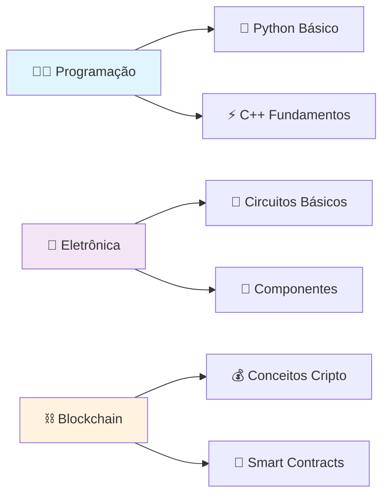

| Área | Nível | Status | Recursos |
|------|-------|--------|----------|
| 🐍 Python | Básico | ⭐⭐⭐⭐⭐ | [Tutorial Interativo](./docs/python-basics.md) |
| ⚡ C++ | Básico | ⭐⭐⭐⭐⭐ | [Guia Prático](./docs/cpp-guide.md) |
| 🔌 Eletrônica | Fundamentos | ⭐⭐⭐⭐⭐ | [Simulador Online](./tools/circuit-simulator) |
| ⛓️ Blockchain | Conceitos | ⭐⭐⭐⭐⭐ | [Playground Web3](./blockchain/playground) |

</details>

***

## 🗺️ Roadmap Completo

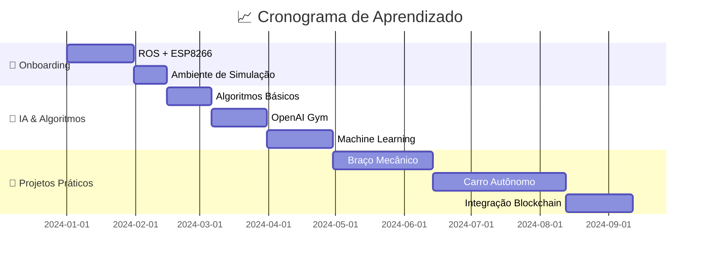

***

## 📚 Módulos do Curso

### 1️⃣ Onboarding - ROS com ESP8266

<div align="center">

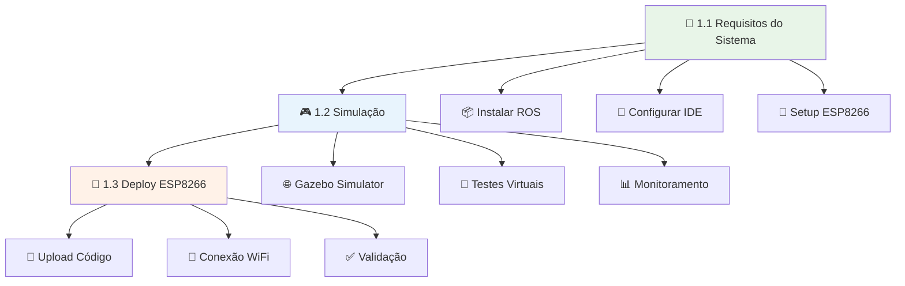

</div>

#### 🎯 Status dos Submódulos

| Módulo | Descrição | Status | Demo |
|--------|-----------|--------|------|
| 1.1 | 🔧 Requisitos do Sistema |  | [▶️ Ver](./demos/requirements) |
| 1.2 | 🎮 Simulação |  | [▶️ Ver](./demos/simulation) |
| 1.3 | 📡 Deploy ESP8266 |  | [▶️ Ver](./demos/deploy) |

***

### 2️⃣ Algoritmos de IA

<details>
<summary>🧠 Clique para explorar os algoritmos</summary>

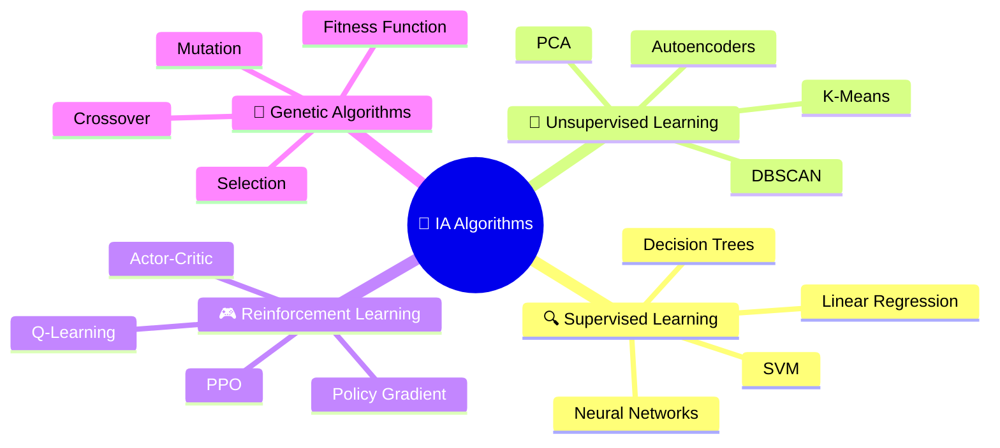

#### 🎛️ Playground Interativo de Algoritmos

| Algoritmo | Visualização | Código | Performance |
|-----------|--------------|--------|-------------|
| 🧬 Genetic Algorithm | [🎮 Demo](./ai/genetic/demo.html) | [📝 Source](./ai/genetic/) |  |
| 🎯 Q-Learning | [🎮 Demo](./ai/qlearning/demo.html) | [📝 Source](./ai/qlearning/) |  |
| 🧠 Neural Network | [🎮 Demo](./ai/neural/demo.html) | [📝 Source](./ai/neural/) |  |

</details>

***

### 3️⃣ Simulação - OpenAI Gym

<div align="center">

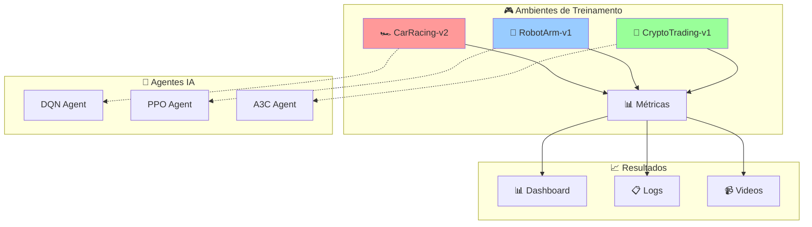

</div>

#### 🎯 Ambientes Disponíveis

<div align="center">

| Ambiente | Descrição | Agente | Status |
|----------|-----------|--------|--------|
| 🏎️ **CarRacing** | Carro autônomo em pista | DQN |  |
| 🤖 **RobotArm** | Braço mecânico pick & place | PPO |  |
| 💰 **CryptoTrading** | Trading automatizado | A3C |  |

</div>

***

## 🔧 Projetos Práticos

### 4.1 🦾 Braço Mecânico

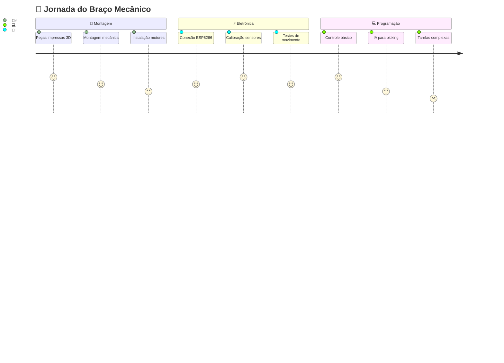

#### 🎯 Tarefas do Braço Mecânico

<details>
<summary>📋 Ver todas as tarefas disponíveis</summary>

| Tarefa | Dificuldade | IA Necessária | Demo |
|--------|-------------|---------------|------|
| 4.1.1 🔧 **Montagem** | ⭐ | ❌ | [📹 Video](./demos/arm-assembly.mp4) |
| 4.1.2 ⚡ **Componentes Elétricos** | ⭐⭐ | ❌ | [📹 Video](./demos/arm-wiring.mp4) |
| 4.1.3 🎯 **Tarefas Básicas** | ⭐⭐⭐ | ✅ | [🎮 Demo](./demos/arm-basic-tasks) |
| 4.1.4 🏗️ **Ângulos Diferentes** | ⭐⭐⭐⭐ | ✅ | [🎮 Demo](./demos/arm-angles) |
| 4.1.5 📦 **Encher Carrinho** | ⭐⭐⭐⭐⭐ | ✅ | [🎮 Demo](./demos/arm-fill-cart) |
| 4.1.6 📤 **Esvaziar Carrinho** | ⭐⭐⭐⭐⭐ | ✅ | [🎮 Demo](./demos/arm-empty-cart) |

</details>

***

### 4.2 🏎️ Carro Autônomo com Pagamento Cripto

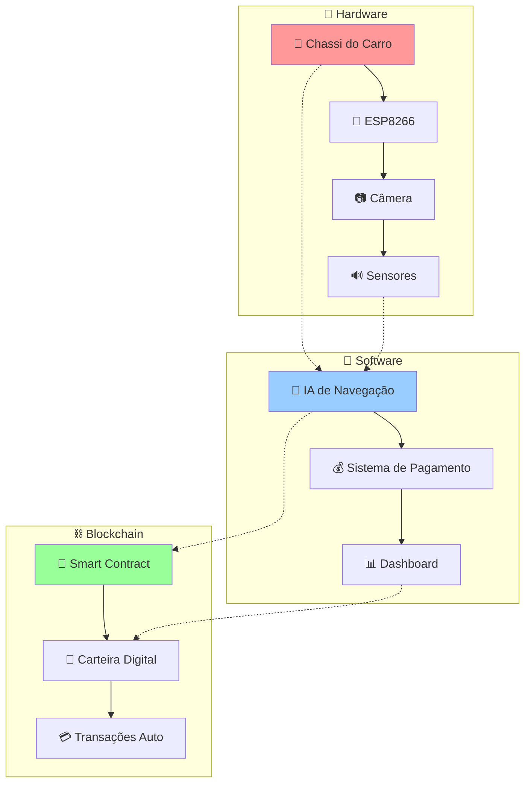

#### 🚀 Fases de Desenvolvimento

| Fase | Descrição | Tecnologias | Status |
|------|-----------|-------------|--------|
| **4.2.1** | 🔧 Montagem do Carrinho | Hardware, 3D Print |  |
| **4.2.2** | 📱 Config Microcontrolador | C++, ESP8266 |  |
| **4.2.3** | 🤖 Lógica Robótica | Python, ROS |  |
| **4.2.4** | 📜 Smart Contracts | Solidity, Web3 |  |

#### 🧠 Algoritmos de IA Implementados

<details>
<summary>🔍 Detalhes dos Algoritmos</summary>

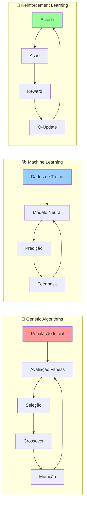

| Algoritmo | Aplicação | Taxa de Sucesso | Código |
|-----------|-----------|-----------------|--------|
| 🧬 **Genetic Algorithm** | Otimização de rota |  | [📝 Ver](./ai/genetic/) |
| 📚 **Neural Networks** | Reconhecimento visual |  | [📝 Ver](./ai/neural/) |
| 🎯 **Q-Learning** | Tomada de decisão |  | [📝 Ver](./ai/qlearning/) |

</details>

***

## 🛠️ Ferramentas e Setup

### 📦 Instalação Rápida

```bash
# 🚀 Clone o repositório
git clone https://github.com/seu-usuario/robotica-ia-journey.git
cd robotica-ia-journey

# 🐍 Setup Python
python -m venv venv
source venv/bin/activate  # Linux/Mac
# venv\Scripts\activate   # Windows

# 📦 Instalar dependências
pip install -r requirements.txt

# 🤖 Setup ROS (Ubuntu)
sudo apt install ros-noetic-desktop-full
echo "source /opt/ros/noetic/setup.bash" >> ~/.bashrc

# ⚡ Configurar ESP8266
# Seguir guia em ./docs/esp8266-setup.md
```

### 🎮 Interface de Controle

<div align="center">

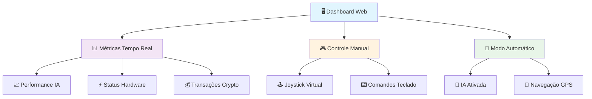

</div>

***

## 📊 Dashboard de Performance

### 🎯 Métricas em Tempo Real

| Métrica | Valor Atual | Meta | Tendência |
|---------|-------------|------|-----------|
| 🎯 **Taxa de Sucesso** | 87.5% | 95% | 📈 |
| ⚡ **Latência Média** | 45ms | <50ms | 📊 |
| 🔋 **Autonomia Bateria** | 3.2h | 4h | 📉 |
| 💰 **Transações/Hora** | 12 | 20 | 📈 |

### 📈 Gráficos de Performance

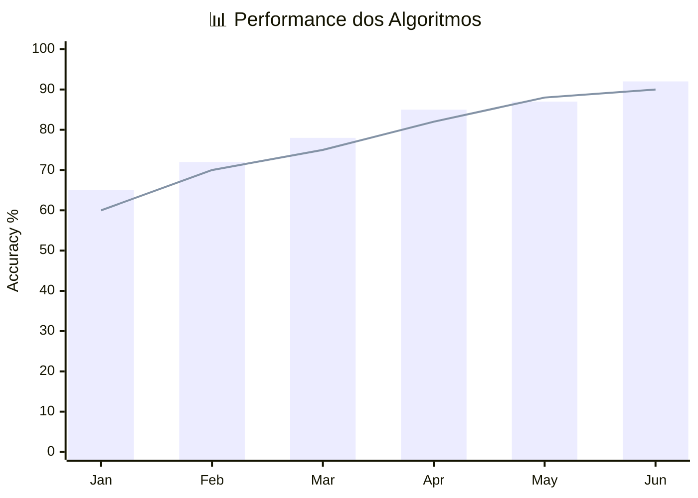

***

## 🎓 Recursos de Aprendizado

### 📚 Documentação Interativa

<div align="center">

| Recurso | Descrição | Tipo | Link |
|---------|-----------|------|------|
| 🎥 **Video Tutoriais** | Passo-a-passo visual | Multimedia | [▶️ Playlist](./docs/videos/) |
| 🧪 **Labs Práticos** | Exercícios hands-on | Interativo | [🔬 Laboratório](./labs/) |
| 📖 **Teoria Completa** | Base conceitual | Texto | [📚 eBook](./docs/theory/) |
| 🎮 **Simuladores** | Ambiente virtual | Software | [🕹️ Simuladores](./simulators/) |

</div>

### 🏆 Sistema de Conquistas

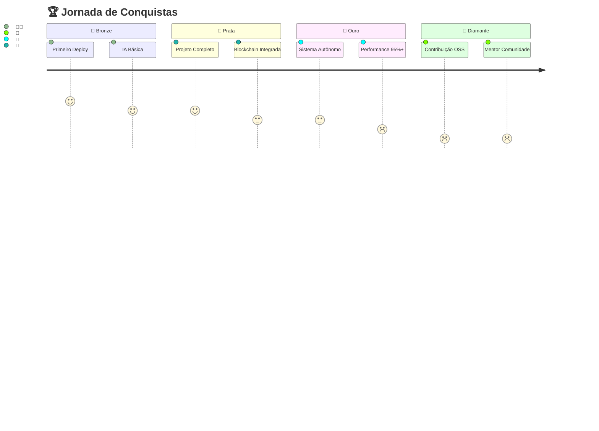

***

## 🤝 Comunidade e Contribuições

### 💬 Canais de Comunicação

<div align="center">

[
[
[

</div>

### 🔄 Como Contribuir

```mermaid
gitgraph
    commit id: "🍴 Fork"
    branch feature
    checkout feature
    commit id: "✨ Feature"
    commit id: "🧪 Tests"
    commit id: "📝 Docs"
    checkout main
    merge feature
    commit id: "🚀 Release"
```

1. 🍴 **Fork** o repositório
2. 🌿 **Crie** uma branch: `git checkout -b feature/nova-funcionalidade`
3. 💾 **Commit** suas mudanças: `git commit -m '✨ Adiciona nova funcionalidade'`
4. 📤 **Push** para a branch: `git push origin feature/nova-funcionalidade`
5. 🔄 **Abra** um Pull Request

***

## 📜 Licença

<div align="center">

[

Este projeto está licenciado sob a **Licença MIT** - veja o arquivo [LICENSE](LICENSE) para detalhes.

</div>

***

## 🚀 Próximos Passos

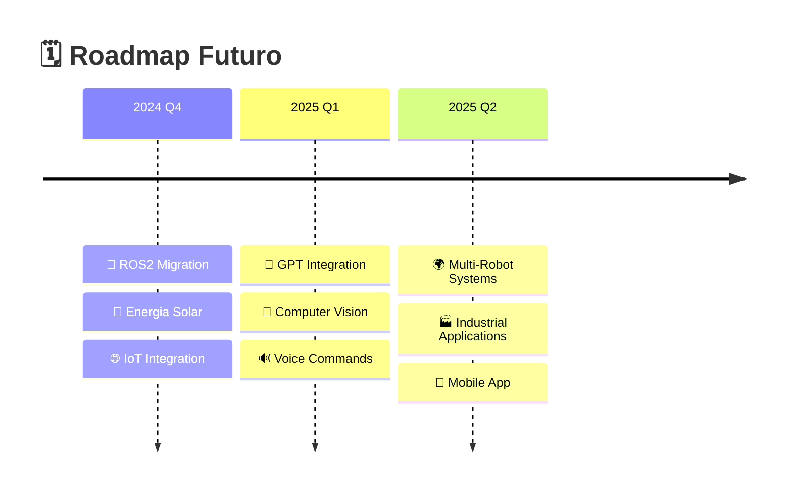

***

<div align="center">

## ⭐ Apoie o Projeto

Se este material te ajudou, considere dar uma ⭐ no repositório!

[
[

**🎓 Transforme seu futuro com Robótica e IA!**

</div>
